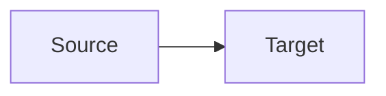

# Excalidraw Diagram — Task

## Input

<!-- 아래에 변환할 Mermaid 코드를 붙여넣으세요 -->

## Output

- Output file: `diagram.excalidraw`

## Task 1: Mermaid 정제

원본 Mermaid에서 스타일(classDef, style, class, init)을 제거하고 컴포넌트 관계만 남긴 `flowchart LR`로 재작성한다. 재작성 결과를 `progress.txt`에 기록한다.

## Task 2: Excalidraw 생성

정제된 Mermaid를 기반으로 `scripts/render-excalidraw-from-mermaid.js`를 실행하거나, CLI가 불가한 경우 `.antigravity/skills/excalidraw-guide.md` 스타일 가이드를 완전히 따라 `diagram.excalidraw` JSON을 직접 생성한다.

## Task 3: QA 검증

`scripts/render-excalidraw-from-mermaid.js --validate-only`를 실행하거나 수동으로 아래 항목을 검증한다:
- Arrow 수 = Mermaid edge 수
- 모든 segment 수평/수직
- 노드 bbox 관통 0건
- Label 겹침 0건
- `roughness: 1`, `fontFamily: 1` 적용 확인

QA 통과 시 `progress.txt`에 완료 마커를 기록한다.
