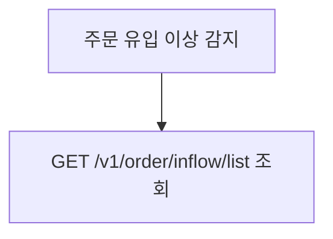

# code-sonar

Code-Sonar는 여러 프로젝트의 소스코드를 읽어 아키텍처, API, 비즈니스 로직, 데이터 흐름, 위키 배포용 Markdown 문서를 생성하는 분석 플러그인이다.

지원 대상은 Gemini CLI, Qwen Code, Claude Code이며, 공용 분석 규칙은 `sonar/` 하위의 skills, agents, templates에 둔다.

---

## 핵심 기능

1. `.env`의 `SONAR_TARGET_DIR` 하위 프로젝트를 분석한다.
2. `.env`의 `SONAR_OUTPUT_DIR`에 프로젝트별 Markdown 문서를 생성한다.
3. System Index에는 전체 통합 Mermaid 그래프를 한 장으로 유지한다.
4. 상세 그래프는 프로젝트별 `Architecture & Dependencies.md`, `Data Flow.md`, `Database Schema.md` 등에 분리한다.
5. Confluence 업로드 시 Markdown을 `markdown` macro로 올려 Mermaid를 렌더링한다.
6. 기존 우수 산출물 수준의 상세도와 위키/코드 근거를 보존한다.
7. `.env`에 Wiki 원본 페이지를 지정하면 child page까지 재귀 수집해 분석 근거로 반영한다.
8. 프로젝트별 문서와 별도로 전체 비즈니스 워크플로우/시나리오 레이어를 생성한다.
9. Evidence Ledger/Audit로 문서의 주요 주장이 실제 근거를 갖는지 점검한다.
10. `.env`로 GitHub 분석을 켜면 GitHub MCP/gh/local git 근거를 함께 수집한다.

---

## 원클릭 설치

Codex:

```bash
./scripts/install-codex.sh
```

Claude Code:

```bash
./scripts/install-claude.sh
```

설치 후 새 세션을 열거나 스킬/플러그인을 다시 로드한다.

---

## 빠른 사용

```bash
/sonar:start
/sonar:multi-scan
/sonar:graph
/sonar:wiki
/sonar:wiki-batch
```

---

## 로컬 설정

`.env`에 분석 대상과 출력 위치를 지정한다.

```bash
SONAR_SYSTEM_ROOT=/Users/jaecjeong/Documents/obsidian/obsidian-google-sync/work
SONAR_TARGET_DIR=/Users/jaecjeong/work/martech
SONAR_OUTPUT_DIR=/Users/jaecjeong/Documents/obsidian/obsidian-google-sync/work/code-sonar

# 선택: 설계/정책 Wiki를 분석 근거로 함께 수집
SONAR_WIKI_SOURCE_URLS=https://wiki.gmarket.com/spaces/ACP/pages/321373771/Affiliate+Channel+Platform+Home
SONAR_WIKI_SOURCE_RECURSIVE=true
SONAR_WIKI_SOURCE_MAX_DEPTH=3

# 선택: GitHub PR/commit/workflow 근거 수집
SONAR_GITHUB_ENABLED=false
SONAR_GITHUB_PROVIDER=auto
SONAR_GITHUB_HOST=github.gmarket.com
SONAR_GITHUB_REPOS=
SONAR_GITHUB_MAX_PULLS=50
SONAR_GITHUB_MAX_COMMITS=200
SONAR_GITHUB_TOKEN_ENV=GITHUB_TOKEN
```

출력 예:

```text
SONAR_OUTPUT_DIR/
├── _Martech System Index.md
├── _wiki-sources/
│   ├── WIKI-SOURCE-INDEX.md
│   └── pages/
├── _github/
│   ├── GITHUB-SOURCE-INDEX.md
│   └── {repo}/
├── _business/
│   ├── Business Workflow.md
│   ├── Scenarios.md
│   └── Cross Project Traceability.md
├── _evidence/
│   ├── Evidence Ledger.md
│   └── Evidence Audit.md
├── affiliate-admin/
│   ├── _affiliate-admin Index.md
│   ├── Architecture & Dependencies.md
│   ├── Backend API.md
│   ├── Business Logic.md
│   └── Data Flow.md
└── affiliate-backend/
    ├── _affiliate-backend Index.md
    ├── Architecture & Dependencies.md
    ├── Backend API.md
    ├── Business Logic.md
    ├── Data Flow.md
    └── Database Schema.md
```

---

## 프로젝트 구조

```text
code-sonar/
├── commands/sonar/                 # Gemini/Qwen slash commands
│   ├── start.toml
│   ├── multi-scan.toml
│   ├── graph.toml
│   ├── wiki.toml
│   └── wiki-batch.toml
├── .claude-plugin/                 # Claude Code plugin metadata and commands
├── .gemini/agents/                 # Gemini agent definitions
├── .qwen/agents/                   # Qwen agent definitions
└── sonar/
    ├── SONAR.md                    # 공용 실행 진입점
    ├── config/sonar-config.md
    ├── skills/
    │   ├── analyze-project/SKILL.md
    │   ├── build-graph/SKILL.md
    │   └── publish-wiki/SKILL.md
    ├── agents/
    │   ├── analyst-backend.md
    │   ├── business-workflow-analyst.md
    │   ├── evidence-auditor.md
    │   ├── github-source-scanner.md
    │   ├── qa-reviewer.md
    │   ├── wiki-source-scanner.md
    │   └── wiki-publisher.md
    └── templates/
```

---

## 위키 업로드 규칙

Confluence 업로드는 로컬 출력 트리를 그대로 반영한다.

```text
{선택한 상위 페이지}
├── Index
├── Business Analysis
│   ├── Business Workflow
│   ├── Scenarios
│   └── Cross Project Traceability
├── Evidence
│   ├── Evidence Ledger
│   └── Evidence Audit
├── affiliate-admin
│   ├── Index
│   ├── affiliate-admin - Architecture & Dependencies
│   ├── affiliate-admin - Backend API
│   ├── affiliate-admin - Business Logic
│   └── affiliate-admin - Data Flow
└── affiliate-backend
    ├── Index
    ├── affiliate-backend - Architecture & Dependencies
    └── ...
```

규칙:

- `SONAR_OUTPUT_DIR` 자체가 `code-sonar`라는 이름이어도 중간 Wiki 페이지로 만들지 않는다.
- 출력 루트의 Markdown 파일과 프로젝트 디렉터리를 선택한 상위 페이지 바로 아래에 생성한다.
- `_... Index.md`, `_... System Index.md`는 Wiki 제목을 `Index`로 올린다.
- 반복되는 비-인덱스 문서명은 `{프로젝트명} - {문서명}`으로 올린다.
- `_business`, `_evidence`는 각각 `Business Analysis`, `Evidence`로 올린다.
- `_wiki-sources`, `_github`는 분석 근거 캐시이므로 Wiki에 올리지 않는다.
- Markdown은 Confluence `markdown` macro로 올린다.
- 프로젝트 디렉터리, `Business Analysis`, `Evidence` 같은 디렉터리 페이지 본문은 ToC 전용으로 작성한다. `# {title}`와 `## Pages` 아래 하위 문서 링크만 두고, 상세 요약이나 placeholder 문장을 넣지 않는다.
- 위키 본문에 `\n`이 글자로 보이면 업로드 실패로 보고 즉시 업데이트한다. `atls --markdown-file`을 우선 사용하고, `--markdown`을 사용할 때는 실제 newline 문자열을 넘긴다.

---

## Wiki Source Scan

`SONAR_WIKI_SOURCE_URLS`를 설정하면 Code-Sonar는 분석 전에 지정 Wiki page와 child page를 재귀 수집한다.

- 수집 결과는 `_wiki-sources/`에 저장한다.
- Wiki는 설계 의도, 정책, 운영 맥락의 보조 근거로 사용한다.
- 구현 사실은 코드와 설정 파일 근거를 우선한다.
- Wiki와 코드가 충돌하면 `> ⚠️ 확인 필요`와 양쪽 근거를 남긴다.

수동 수집:

```bash
python3 scripts/scan-wiki-sources.py
```

수집 페이지 수가 많은 경우 `SONAR_WIKI_SOURCE_MAX_PAGES`로 안전상한을 조정한다.

---

## 비즈니스 레이어

다중 프로젝트 분석 후 `_business/`에 전체 시스템 관점이 아니라 업무 의사결정 관점의 문서를 생성한다. 이 레이어는 `System Index`, 프로젝트별 `Data Flow`, `Batch Jobs`를 다시 요약하는 장소가 아니다.

- `Business Workflow.md`: 업무 상태별 질문, 판정 조건, 책임 프로젝트, 근거, 운영 확인 위치
- `Scenarios.md`: 운영/예외 시나리오 중심의 `Trigger → 증상 → 확인 순서 → 시스템 처리 → 운영자 판단 → 후속 조치`
- `Cross Project Traceability.md`: “왜 특정 주문이 정산 제외됐나?” 같은 업무 질문별 확인 순서

품질 계약:

- 정상 흐름은 1개 이하로 제한하고, 운영/예외 시나리오를 최소 6개 작성한다.
- 필수 시나리오: 주문 이벤트 누락, LAST_TARGET_URL 미등록, 주문-유입 매핑 실패, 배송완료/환불 누락 보정, 월지급 전 정합성 실패, Open API token 검증 실패.
- `_business/Business Workflow.md`의 Mermaid는 번호가 붙은 업무 단계 `flowchart LR`만 허용한다.
- System Index와 유사한 컴포넌트/계층 subgraph나 기존 프로젝트 문서의 70% 이상 중복 요약은 QA 반려 대상이다.

---

## GitHub Source Scan

`SONAR_GITHUB_ENABLED=true`를 설정하면 Code-Sonar는 GitHub 변경 이력과 운영 맥락을 분석 근거로 함께 수집한다.

Provider 우선순위:

1. GitHub MCP
2. `gh` CLI
3. local git remote/commit/workflow 파일

`.env` 예시:

```bash
SONAR_GITHUB_ENABLED=true
SONAR_GITHUB_PROVIDER=auto
SONAR_GITHUB_HOST=github.gmarket.com
SONAR_GITHUB_REPOS=https://github.gmarket.com/org/repo,https://github.gmarket.com/org/other-repo
SONAR_GITHUB_MAX_PULLS=50
SONAR_GITHUB_MAX_COMMITS=200
SONAR_GITHUB_OUTPUT_DIR=/Users/jaecjeong/Documents/obsidian/obsidian-google-sync/work/code-sonar/_github
SONAR_GITHUB_TOKEN_ENV=GITHUB_TOKEN
```

토큰은 `.env`에 직접 쓰지 않고, `SONAR_GITHUB_TOKEN_ENV`가 가리키는 환경변수에 둔다.

```bash
export GITHUB_TOKEN=...
```

GitHub MCP 설정 방향:

- Codex 또는 Claude Code의 MCP 설정에 GitHub 서버를 등록한다.
- Enterprise host를 쓰는 경우 GitHub MCP server의 `GITHUB_HOST` 환경변수 또는 `--gh-host` 옵션을 `https://github.gmarket.com`으로 맞춘다.
- 분석용으로는 read-only 모드와 필요한 toolset만 켜는 것을 권장한다.
- MCP가 연결되어 있으면 Code-Sonar는 MCP를 우선 사용한다.
- MCP가 없으면 `gh auth login --hostname github.gmarket.com`으로 로그인된 `gh`를 사용한다.
- `gh`도 없거나 로그인되지 않았으면 local git remote, 최근 commit, `.github/workflows/*`만 수집한다.

로컬 GitHub MCP Docker 예시:

```json
{
  "servers": {
    "github": {
      "command": "docker",
      "args": [
        "run",
        "-i",
        "--rm",
        "-e",
        "GITHUB_PERSONAL_ACCESS_TOKEN",
        "-e",
        "GITHUB_HOST",
        "-e",
        "GITHUB_TOOLSETS",
        "-e",
        "GITHUB_READ_ONLY",
        "ghcr.io/github/github-mcp-server"
      ],
      "env": {
        "GITHUB_PERSONAL_ACCESS_TOKEN": "${GITHUB_TOKEN}",
        "GITHUB_HOST": "https://github.gmarket.com",
        "GITHUB_TOOLSETS": "repos,pull_requests,actions,issues",
        "GITHUB_READ_ONLY": "1"
      }
    }
  }
}
```

공식 GitHub MCP 참고:

- https://github.com/github/github-mcp-server
- https://docs.github.com/en/copilot/how-tos/provide-context/use-mcp-in-your-ide/enterprise-configuration

GitHub 근거의 용도:

- PR/commit/workflow/CODEOWNERS/템플릿을 통해 변경 이력과 운영 맥락을 보강한다.
- 현재 구현 사실은 코드와 설정 파일 근거를 우선한다.
- GitHub-only 근거는 구현 사실이 아니라 변경 이력/운영 맥락으로 표시한다.

---

## Evidence 검증

산출물의 주요 주장은 `_evidence/Evidence Ledger.md`와 연결되어야 한다.

- 구현 동작: `code` 또는 `config` 근거 필요
- 설계/정책: `wiki` 근거 가능
- 변경 이력/운영 맥락: `github` 근거 가능
- 추론: `inferred`로 표시하고 확정 표현 금지
- 감사 결과: `_evidence/Evidence Audit.md`

`atls` 사용 예:

```bash
atls wiki create "Index" --markdown-file "_Martech System Index.md" --space "~jaecjeong" --parent <parent-id>
atls wiki update <page-id> "affiliate-admin - Data Flow" --markdown-file "affiliate-admin/Data Flow.md"
```

---

## Mermaid 작성 규칙

- 통합 시스템 구성도는 `flowchart LR` 한 장으로 작성한다.
- System Index 그래프는 `theme: "base"`와 밝은 파스텔 색상을 사용한다.
- 상세 시퀀스와 업무 데이터플로우는 프로젝트별 세부 문서에 둔다.
- `graph TD/LR` 대신 `flowchart TD/LR`를 사용한다.
- `A --> B & C` 축약 문법을 쓰지 않는다.
- API path, URL, 슬래시(`/`), 콜론(`:`), `<br/>`가 들어간 노드 라벨은 quote 처리한다.



---

## 검증

```bash
find "$SONAR_OUTPUT_DIR" -maxdepth 2 -type f -name '*.md' | sort
atls wiki children <page-id> --limit 100
```

이전 구조명이나 폐기된 출력 경로가 활성 프롬프트에 다시 들어가지 않도록 정기적으로 점검한다.
# code-sonar
# code-sonar
# code-sonar
