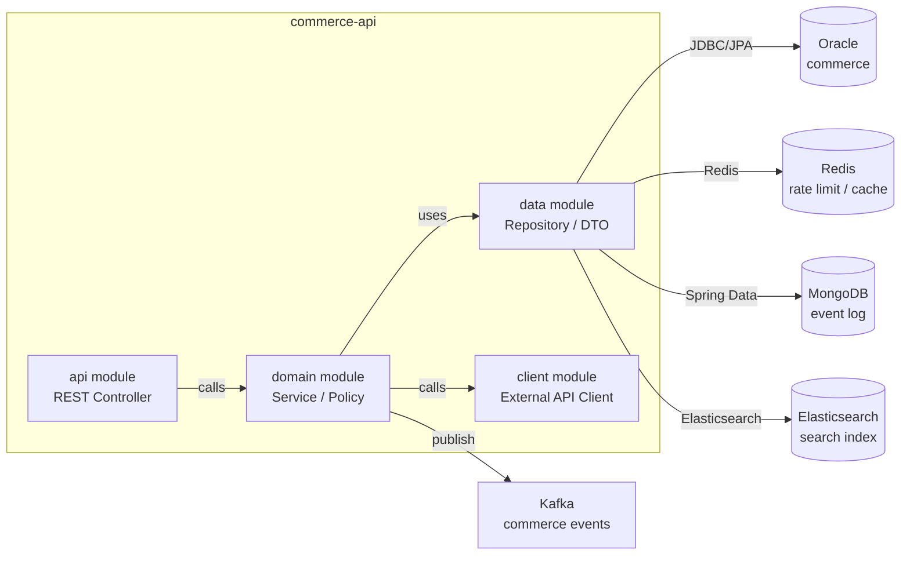

# Architecture & Dependencies

이 문서는 `commerce-api`의 모듈 구조와 런타임 의존성을 설명한다.

## Module View

## Runtime Dependencies

| Dependency | Direction | Purpose | Evidence |
| --- | --- | --- | --- |
| Oracle | outbound | primary transaction data | `OrderRepository` |
| Redis | outbound | rate limit, cache, lock | `RateLimitFilter` |
| MongoDB | outbound | event and audit log | `EventLogRepository` |
| Elasticsearch | outbound | search and dashboard query | `SearchClient` |
| Kafka | outbound | order and settlement event | `EventPublisher` |

## Risk Notes

- Redis key TTL과 rate limit threshold는 운영 영향이 크므로 config evidence가 필요하다.
- Elasticsearch는 조회 최적화 목적이며 primary source of truth가 아니다.
- Kafka publish 실패는 재시도와 보상 흐름 문서가 필요하다.
