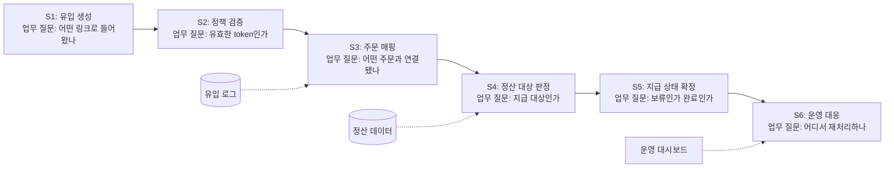

# Business Workflow

이 문서는 시스템 컴포넌트가 아니라 업무 판단 상태를 기준으로 작성한다.

## 업무 단계별 판단

| Step | 업무 질문 | 판정 조건 | 담당 프로젝트 | 확인 근거 | 운영 확인 위치 |
| --- | --- | --- | --- | --- | --- |
| S1 | 어떤 링크로 유입됐나 | target URL과 tracking token 존재 | commerce-web | `TrackingController` | 유입 로그 |
| S2 | 유효한 token인가 | 만료, 정책, rate limit 통과 | commerce-api | `TokenPolicyService` | Redis key |
| S3 | 주문과 연결됐나 | 주문 번호와 유입 키 매칭 | commerce-event | `OrderConsumer` | mapping table |
| S4 | 지급 대상인가 | 취소, 환불, 중복 제외 | commerce-batch | `SettlementJob` | settlement table |
| S5 | 지급 완료인가 | lock date 이후 상태 확정 | commerce-batch | `PayoutService` | monthly settlement |
| S6 | 운영 조치가 필요한가 | 실패 건 존재 또는 재처리 요청 | commerce-admin | `AdminRetryController` | admin page |
