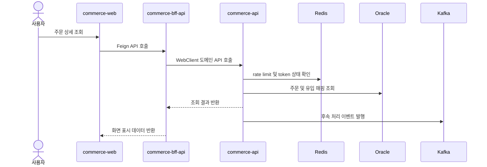
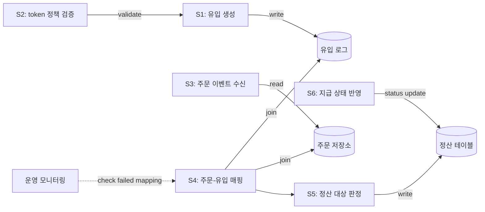

# Data Flow

## Representative Runtime Sequence

## Business Dataflow

## 운영 확인 포인트

| Step | 확인 위치 | 실패 시 조치 |
| --- | --- | --- |
| 유입 생성 | 유입 로그 저장소 | token, target URL, policy 확인 |
| 주문 수신 | Kafka consumer lag | 누락 이벤트 재처리 |
| 매핑 | 주문-유입 매핑 테이블 | 키 값과 시간 범위 확인 |
| 정산 판정 | 정산 집계 테이블 | 제외 사유와 보류 상태 확인 |
