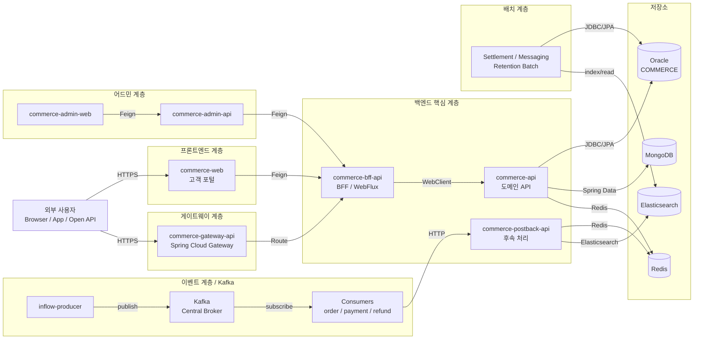

# Index

## System Overview

Commerce Platform은 외부 사용자 요청, 관리자 작업, API 처리, 이벤트 처리, 배치 정산, 저장소 접근을 여러 프로젝트가 나누어 처리하는 예시 시스템이다.

## Project Map

| Project | Responsibility | Main Evidence |
| --- | --- | --- |
| commerce-admin | 운영자 화면과 관리자 API | `commerce-admin/Backend API.md` |
| commerce-api | 핵심 도메인 처리와 저장소 접근 | `commerce-api/Business Logic.md` |
| commerce-gateway | 외부 요청 라우팅과 보안 정책 | `commerce-gateway/Routing & Security.md` |
| commerce-batch | 일별 집계와 월별 정산 배치 | `commerce-batch/Batch Jobs.md` |

## Operations Inventory

| Item | Value | Evidence |
| --- | --- | --- |
| API domain | `api.example.com` | Wiki source `WIKI-001` |
| Admin domain | `admin.example.com` | config `application-prod.yml` |
| Redis usage | rate limit, temporary state, token cache | code `RedisRateLimiter` |
| Secret values | redacted | policy |
