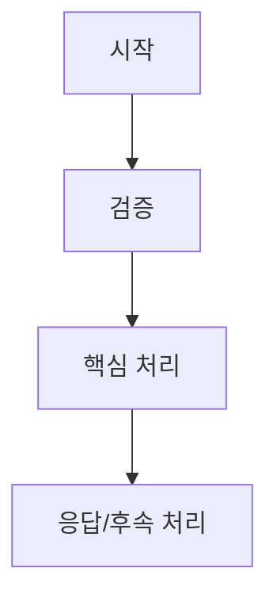

# ANALYZE.md — 기능 분석 템플릿

> 한 기능 또는 한 도메인의 코드 근거를 요약한다. 프로젝트별 최종 문서는 필요에 따라 `Business Logic.md`, `Backend API.md`, `Data Flow.md` 등으로 분리한다.

## 1. 기능 개요

| 항목 | 내용 |
|:---|:---|
| 기능명 | {기능명} |
| 프로젝트 | {프로젝트명} |
| 트리거 | {사용자 요청 / 배치 / 이벤트 / 외부 호출} |
| 진입점 | `{파일 경로}` |

## 2. 관련 코드

| 레이어 | 파일/클래스 | 역할 |
|:---|:---|:---|
| Controller/Route | `{파일}` | {역할} |
| Service/UseCase | `{파일}` | {역할} |
| Repository/Client | `{파일}` | {역할} |
| DTO/Model | `{파일}` | {역할} |

## 3. 핵심 흐름

> 흐름 요약: {1~3문장}

## 4. 호출/연동

| 대상 | 방식 | 목적 | 근거 |
|:---|:---|:---|:---|
| {내부/외부 시스템} | {HTTP/Kafka/DB/etc} | {목적} | `{파일 경로}` |

## 5. 데이터

| 저장소/테이블/토픽 | 읽기/쓰기 | 설명 | 근거 |
|:---|:---|:---|:---|
| `{이름}` | {R/W/Pub/Sub} | {설명} | `{파일 경로}` |

## 6. 예외와 리스크

| 조건 | 처리 | 리스크/비고 |
|:---|:---|:---|
| {조건} | {처리} | {비고} |

## 작성 규칙

1. 코드에서 확인한 사실만 작성한다.
2. API path/URL이 Mermaid 노드에 들어가면 quote 처리한다.
3. 내용이 길어지면 최종 산출물에서는 주제별 문서로 분리한다.
