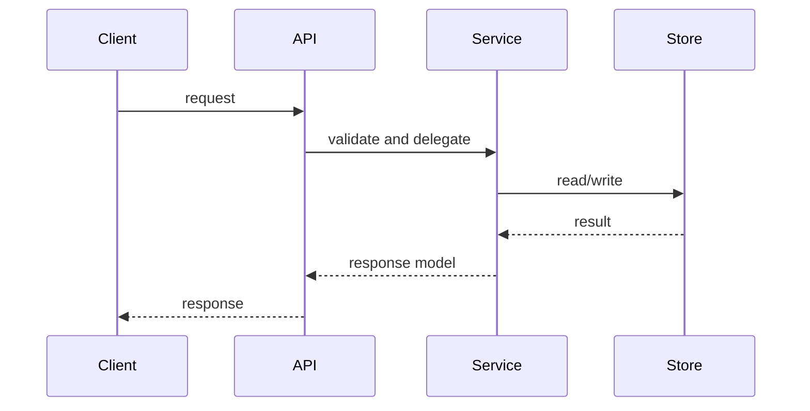

# API-SPEC.md — API 상세 명세

> 코드에서 확인한 API 계약을 요청, 응답, 검증, 호출 흐름 기준으로 작성한다.

## 1. API 개요

| 항목 | 내용 |
|:---|:---|
| API명 | {API명} |
| Method | {GET / POST / PUT / PATCH / DELETE} |
| Path | `{/api/path}` |
| 구현 위치 | `{Controller/Handler 파일 경로}` |
| 호출 주체 | {화면 / 외부 시스템 / 내부 서비스} |
| 인증/권한 | {확인된 인증 방식 또는 해당 없음} |

## 2. 요청

### 2-1. Headers

| 이름 | 필수 | 설명 | 근거 |
|:---|:---:|:---|:---|
| `{Header}` | {Y/N} | {설명} | `{파일 경로}` |

### 2-2. Path Parameters

| 이름 | 타입 | 필수 | 설명 |
|:---|:---|:---:|:---|
| `{id}` | {Type} | Y | {설명} |

### 2-3. Query Parameters

| 이름 | 타입 | 필수 | 기본값 | 설명 |
|:---|:---|:---:|:---|:---|
| `{page}` | Integer | N | `{0}` | {설명} |

### 2-4. Body

| 필드 | 타입 | 필수 | 설명 | 제약 |
|:---|:---|:---:|:---|:---|
| `{field}` | String | Y | {설명} | {검증 규칙} |

## 3. 응답

| 필드 | 타입 | 설명 | 근거 |
|:---|:---|:---|:---|
| `{resultCode}` | String | {통신 결과 코드} | `{파일 경로}` |
| `{data}` | Object | {응답 데이터} | `{파일 경로}` |

## 4. 샘플

### Request

```http
GET /api/path?sample=value HTTP/1.1
Host: {host}
```

### Response

```json
{
  "resultCode": "0000",
  "data": {}
}
```

## 5. 처리 흐름



## 6. 오류/예외

| 상황 | 응답 코드 | 처리 위치 | 비고 |
|:---|:---|:---|:---|
| {상황} | `{코드}` | `{파일 경로}` | {비고} |

## 작성 규칙

1. 코드에서 확인한 필드만 확정 정보로 작성한다.
2. DTO/Schema/Validation annotation 근거를 함께 남긴다.
3. 외부 문서 기반 추정은 `확인 필요`로 표시한다.
4. API path가 Mermaid 노드에 들어가면 반드시 quote 처리한다.
