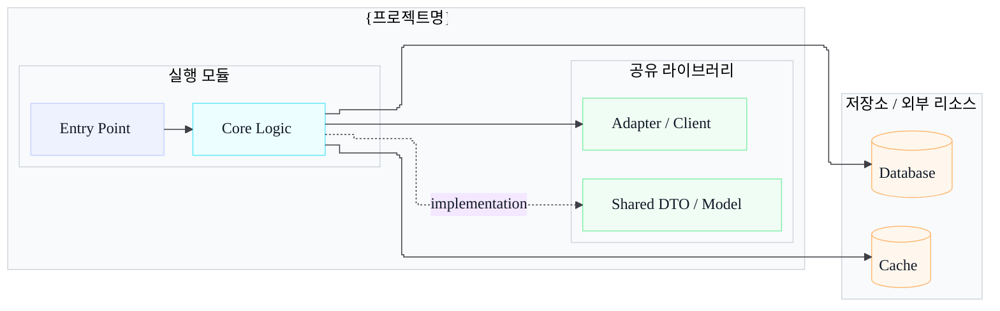

# ARCHITECTURE.md — 프로젝트 아키텍처 템플릿

> 전체 시스템 통합 그래프는 System Index에 두고, 이 문서는 개별 프로젝트 관점의 구조와 의존성을 설명한다.

## 1. 역할

| 항목 | 내용 |
|:---|:---|
| 프로젝트 | {프로젝트명} |
| 시스템 내 책임 | {책임} |
| 런타임 | {언어/프레임워크} |
| 배포 단위 | {서비스/배치/프론트엔드 등} |

## 2. 내부 구조

> Excalidraw로 내보낼 경우 `scripts/render-excalidraw-from-mermaid.js`를 우선 사용한다. 화살표는 모두 Arrow Type `직각`, `elbowed: true`, `roundness: null`, port/rail routing, 수평/수직 `points`를 적용하고 대각선 2-point arrow, 노드 관통, 라벨 겹침을 만들지 않는다.

## 3. 외부 의존성

| 대상 | 유형 | 프로토콜/방식 | 목적 | 근거 |
|:---|:---|:---|:---|:---|
| {시스템명} | {API/Event/DB/Cache/Search} | {HTTP/Kafka/JDBC/etc} | {목적} | `{파일 경로}` |

## 4. 저장소

| 저장소 | 사용 방식 | 주요 데이터 | 근거 |
|:---|:---|:---|:---|
| {Oracle/Redis/Mongo/etc} | {read/write/cache/index} | {데이터} | `{파일 경로}` |

## 5. 설정과 보안

| 항목 | 위치 | 설명 |
|:---|:---|:---|
| {설정명} | `{파일 경로}` | {설명} |

## 6. 운영 리스크

| 리스크 | 영향 | 확인 방법 |
|:---|:---|:---|
| {리스크} | {영향} | {로그/메트릭/코드 경로} |

## 작성 규칙

1. 프로젝트 내부 상세 그래프만 작성한다.
2. 다른 프로젝트와의 전체 연결은 System Index에 링크한다.
3. 확인되지 않은 의존성은 추정으로 쓰지 않는다.
4. 멀티모듈 그래프는 실행 모듈, 공유 라이브러리, 저장소/외부 리소스를 좌우 컬럼으로 분리한다.
5. Gradle `implementation project` 같은 빌드 의존성은 점선으로, WebClient/Feign/JDBC/Redis/ES 같은 런타임 호출은 실선으로 표현한다.
6. 저장소는 원통형 노드를 사용하고 오른쪽 컬럼에 모아 시스템 구성도와 같은 밝은 파스텔 스타일을 유지한다.
