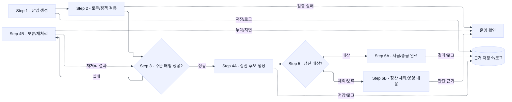

# Business Workflow

> 전체 프로젝트를 관통하는 업무 판단 레이어입니다. 프로젝트별 세부 구현 요약은 각 프로젝트 문서에 두고, 이 문서는 업무 상태, 판정 조건, 예외 대응, 운영 확인 위치에 집중합니다.
>
> 작성 금지: System Index와 유사한 컴포넌트/계층형 구성도, 프로젝트별 `Data Flow`/`Batch Jobs` 단순 요약, 저장소를 오른쪽 끝 계층으로 크게 배치한 시스템 지도.

## 1. Business Decision Map

| 업무 상태 | 업무 질문 | 판정 조건 | 담당 프로젝트 | 확인 근거 | 운영 확인 위치 |
|:---|:---|:---|:---|:---|:---|
| 유입 생성 | 어떤 링크/채널에서 들어온 유입인가? | `service-code`, `sub-id`, `target-url`, token/cookie 생성 여부 |  |  |  |
| 토큰/정책 검증 | 이 유입을 주문/정산 후보로 인정할 수 있는가? | 정책, 회원, 서비스, LAST_TARGET_URL, Open API token 유효성 |  |  |  |
| 주문 매핑 성공/실패 | 주문 이벤트가 유입 token과 연결됐는가? | 주문 이벤트 수신, token 매칭, 미처리 token 경과 시간 |  |  |  |
| 정산 대상 판정 | 이 주문이 정산 대상인가? | 결제/배송/환불/취소 상태, 중복/제외 조건 |  |  |  |
| 지급 보류/완료 | 지급/송금/회계 처리로 넘겨도 되는가? | 월지급 정합성, 사업자/회원 정보, 회계 요청 성공 여부 |  |  |  |
| 운영 대응 | 어디서 실패를 확인하고 어떤 조치를 해야 하는가? | 로그/대시보드/배치 결과/재처리 결과 |  |  |  |

## 2. End-to-End Workflow

> 이 다이어그램은 시스템 구성도가 아니라 업무 선후관계입니다. 번호가 붙은 업무 상태만 왼쪽에서 오른쪽으로 배치하고, 저장소/모니터링/재처리는 점선 보조 근거로만 둡니다.

## 3. Stage Decisions

| 단계 | 업무 질문 | 판정 조건 | 담당 프로젝트 | 운영 확인 위치 | 근거 |
|:---|:---|:---|:---|:---|:---|
| 1. 유입 생성 |  |  |  |  |  |
| 2. 토큰/정책 검증 |  |  |  |  |  |
| 3. 주문 매핑 성공? |  |  |  |  |  |
| 4A. 정산 후보 생성 |  |  |  |  |  |
| 5. 정산 대상? |  |  |  |  |  |
| 6A. 지급/송금 완료 |  |  |  |  |  |
| 보류/예외 |  |  |  |  |  |

## 4. Operating Questions

| 운영 질문 | 먼저 확인할 것 | 다음 확인 | 판단 | 후속 조치 |
|:---|:---|:---|:---|:---|
| 왜 특정 주문이 정산 제외됐나? |  |  |  |  |
| 왜 postback이 안 갔나? |  |  |  |  |
| 어떤 링크가 잘못 유입됐나? |  |  |  |  |
| 왜 주문 매핑이 지연됐나? |  |  |  |  |

## 5. Evidence Gaps

> 해당 없음
