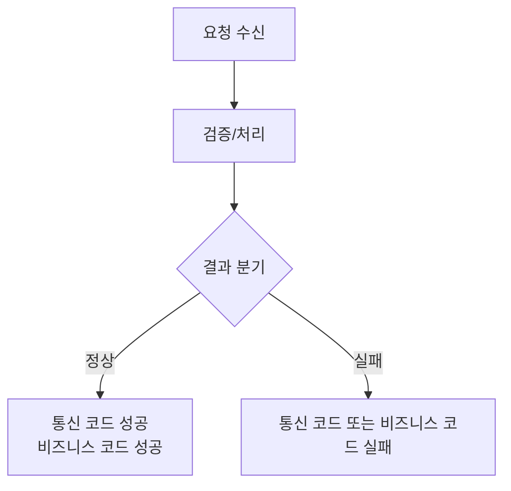

# CODE-INFO.md — 응답/상태 코드 분석

> API 응답 코드와 비즈니스 상태 코드의 역할을 분리하여 정리한다.

## 1. 기본 정보

| 항목 | 내용 |
|:---|:---|
| 프로젝트 | {프로젝트명} |
| 기능/시나리오 | {기능명} |
| 코드 정의 위치 | `{파일 경로}` |

## 2. 통신 레벨 코드

| 필드 | 코드 | 의미 | HTTP Status | 근거 |
|:---|:---|:---|:---:|:---|
| `{resultCode}` | `{0000}` | {성공} | {200} | `{파일 경로}` |

## 3. 비즈니스 레벨 코드

| 필드 | 값 | 의미 | 발생 조건 | 근거 |
|:---|:---|:---|:---|:---|
| `{status}` | `{VALUE}` | {의미} | {조건} | `{파일 경로}` |

## 4. 코드 사용 흐름

## 5. 해석 규칙

- 통신 성공과 업무 성공이 다른 필드로 분리되어 있으면 반드시 구분한다.
- 같은 코드가 여러 의미로 쓰이면 사용 위치별로 행을 나눈다.
- 외부 시스템 코드와 내부 코드가 매핑되면 매핑 테이블을 추가한다.
