# DATA-FLOW.md — 서비스 계층 데이터플로우 & 비즈니스플로우 작성 기준

> 이 템플릿은 **서비스 레이어에서 흘러가는 데이터와 비즈니스 로직의 흐름**을 계층 단위로 문서화하는 기준이다.  
> `ANALYZE.md`가 정적 구조(클래스/API/스키마)를 다룬다면, 이 문서는 **런타임 동작과 상태 변이**에 초점을 맞춘다.

---

## 파일 헤더

```markdown
# {서비스구분}[데이터플로우] {기능명 또는 도메인명}

> **서비스:** 지마켓 / 옥션 / 공통
> **스택:** Spring Boot (Java) / Next.js / .NET (C#)
> **분석 대상 경로:** `{패키지 또는 디렉토리 경로}`
> **최초 작성일:** YYYY-MM-DD
> **작성자:** Code-Sonar (자동 분석)
```

---

## 섹션 구성

분석 결과는 아래 섹션 순서대로 작성한다.  
**해당 내용이 없는 섹션은 `> 해당 없음` 으로 표기하고 생략하지 않는다.**

---

### 1. 도메인 개념 맵

이 기능이 다루는 핵심 도메인 개념과 그 관계를 표현한다.

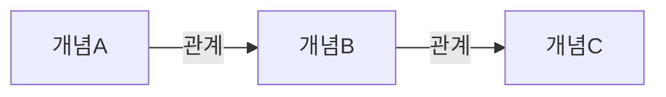

| 개념 | 설명 | 관련 Entity / 테이블 |
|:---|:---|:---|
| | | |

---

### 2. 서비스 계층 호출 흐름 (Call Chain)

컨트롤러부터 Repository까지 실제 코드 상의 메서드 호출 체인을 표현한다.

```
Controller.method()
  └─ ServiceA.method(dto)
       ├─ ServiceB.validate(param)      // 유효성 검증
       ├─ RepositoryA.findByXxx(id)     // DB 조회
       │    └─ SQL: SELECT ... WHERE ...
       ├─ ServiceC.calculate(entity)    // 비즈니스 계산
       └─ RepositoryB.save(entity)      // DB 저장
            └─ SQL: INSERT INTO ...
```

> **흐름 요약:** {호출 체인을 1~3줄로 요약}

---

### 3. 대표 런타임 시퀀스 다이어그램

사용자 요청, 내부 API 호출, 이벤트 발행/구독, DB 저장까지 시간 순서가 중요한 대표 시나리오를 표현한다.
분석 대상 기능에 외부 사용자 흐름이 없으면 배치/Consumer 진입점을 첫 participant로 둔다.

```mermaid
sequenceDiagram
    autonumber
    participant Actor as 사용자/외부 시스템
    participant Entry as 진입점<br/>{Controller / Consumer / Batch}
    participant Svc as 서비스 계층<br/>{Service.method}
    participant Api as 내부/외부 API
    participant Bus as Event Bus
    participant DB as 저장소

    Actor->>Entry: {요청/이벤트} {핵심 입력값}
    Entry->>Svc: {Service.method(dto)}
    Svc->>DB: 조회 {테이블/키}
    alt 외부 연동 필요
        Svc->>Api: {HTTP/Feign/WebClient} {요청 데이터}
        Api-->>Svc: {응답 데이터}
    end
    opt 이벤트 발행
        Svc->>Bus: publish {topic/event}
    end
    Svc->>DB: 저장/상태 변경 {테이블/컬럼}
    Svc-->>Entry: 처리 결과
    Entry-->>Actor: 응답/후속 처리
```

**시퀀스 작성 규칙:**
- participant는 실제 시스템/클래스/저장소 이름을 사용한다.
- 메시지 라벨에는 프로토콜, 메서드명, 토픽명, 테이블명 중 확인된 값을 넣는다.
- `alt`, `opt`, `loop`는 코드에서 확인된 분기/반복만 사용한다.
- 16개 메시지를 넘으면 같은 문서의 별도 시나리오로 분리한다.

| 순서 | 호출자 | 피호출자 | 방식 | 데이터 | 구현 위치 |
|:---:|:---|:---|:---|:---|:---|
| 1 | | | HTTP / Kafka / Method / SQL | | `{ClassName}.{method}():{line}` |

---

### 4. 업무 데이터플로우 다이어그램

첨부 예시처럼 업무 단계, 이벤트 버스, 저장소, 배치, 외부 시스템 간 데이터 이동을 한 장의 가로 흐름으로 표현한다.
이 다이어그램은 “데이터가 어디서 생기고, 어떤 처리 단계를 거쳐, 어떤 저장소와 후속 시스템으로 전달되는가?”에 답해야 한다.

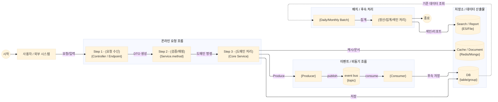

**데이터플로우 표기 규칙:**
- 실선 `-->`은 데이터 생성/전달/상태 변경을 의미한다.
- 점선 `-. ... .->`은 조회, 참조, 기준 데이터 사용처럼 원본을 변경하지 않는 의존을 의미한다.
- 처리 노드는 업무 단계명과 실제 코드 진입점 또는 배치/Consumer 이름을 함께 적는다.
- 저장소 노드는 원통형 `[(...)]` 또는 `[("...")]`로 표현하고, 테이블/컬렉션/인덱스 이름을 가능한 한 적는다.
- 이벤트 버스는 `event bus` 또는 실제 브로커/토픽명으로 표시한다.
- 왼쪽에서 오른쪽으로 업무 시간이 흐르도록 작성하고, 저장소는 관련 처리 단계 아래 또는 오른쪽에 둔다.

| 데이터 산출물 | 생성 단계 | 저장 위치 | 주요 필드 | 후속 사용처 |
|:---|:---|:---|:---|:---|
| | | `{table/topic/key/index}` | | |

---

### 5. 입력 데이터 → 출력 데이터 변환 흐름

데이터가 계층을 거치면서 어떻게 변환/가공되는지 보여준다.

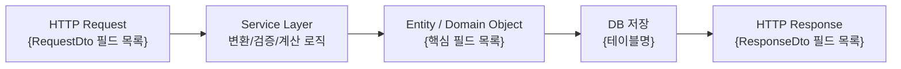

**주요 변환 포인트:**

| 계층 간 전환 | 변환 클래스 | 변환 내용 |
|:---|:---|:---|
| Request → Service | MapStruct Mapper / 직접 변환 | |
| Entity → Response | MapStruct Mapper / 직접 변환 | |

---

### 6. 핵심 비즈니스 규칙 & 조건 분기

서비스 레이어의 핵심 if-else/switch 분기와 비즈니스 규칙을 열거한다.

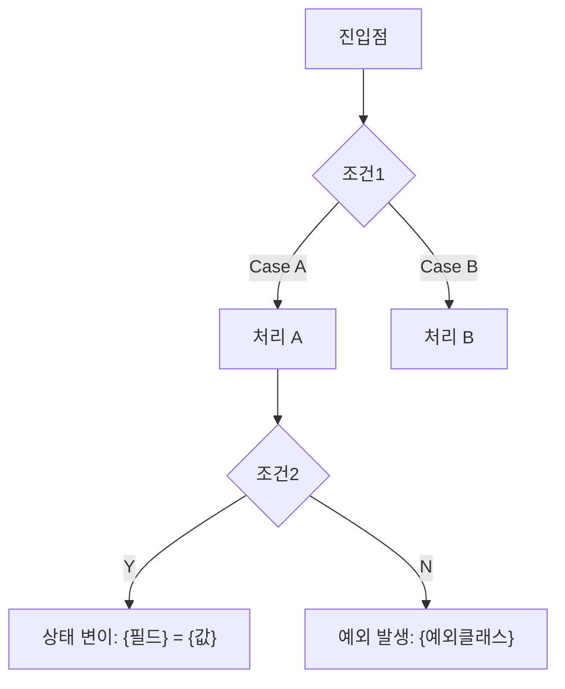

**비즈니스 규칙 목록:**

| 규칙 ID | 규칙 설명 | 적용 조건 | 구현 위치 |
|:---|:---|:---|:---|
| BR-001 | | | `{ClassName}.{method}():{line}` |

---

### 7. 상태 전이 다이어그램 (State Machine)

도메인 엔티티의 상태값이 비즈니스 로직에 따라 어떻게 변하는지 표현한다.  
상태값 컬럼(status, state, yn 플래그 등)이 있는 경우 반드시 작성한다.

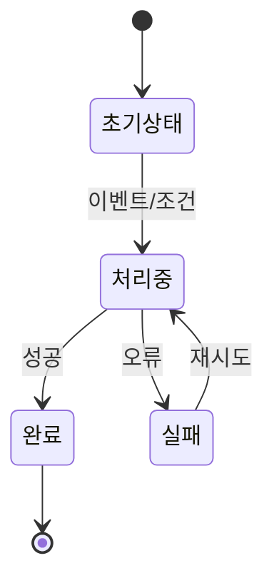

**상태 코드 정의:**

| 상태값 | 의미 | 전이 조건 | 다음 상태 |
|:---|:---|:---|:---|
| | | | |

---

### 8. 외부 시스템 연동 데이터 흐름

외부 API, Kafka, Redis, 파일 등 외부 시스템과의 데이터 교환 흐름을 표현한다.

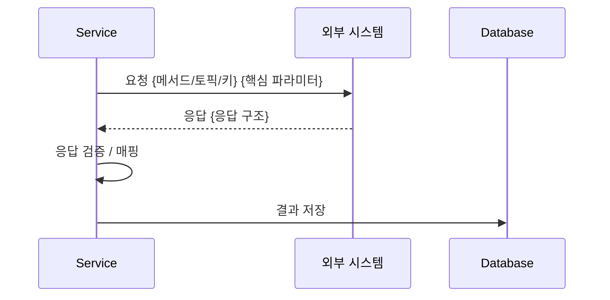

**연동 포인트 목록:**

| 대상 시스템 | 연동 방식 | 요청 데이터 | 응답 데이터 | 오류 처리 |
|:---|:---|:---|:---|:---|
| | REST / Kafka / Redis | | | |

---

### 9. 트랜잭션 경계

`@Transactional` 어노테이션 적용 범위와 트랜잭션 전파 정책을 정리한다.

| 메서드 | 전파 정책 | ReadOnly | 예외 롤백 조건 |
|:---|:---|:---:|:---|
| `ServiceA.save()` | REQUIRED (기본) | N | RuntimeException |
| `ServiceB.readOnly()` | REQUIRED | Y | — |

**트랜잭션 경계 다이어그램:**

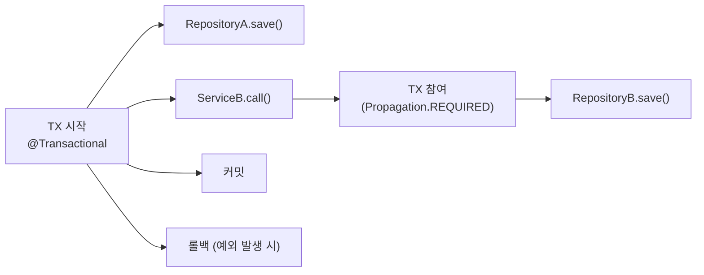

---

### 10. 비동기 처리 흐름

`@Async`, Kafka, CompletableFuture, WebFlux 등 비동기 처리가 포함된 경우 작성한다.

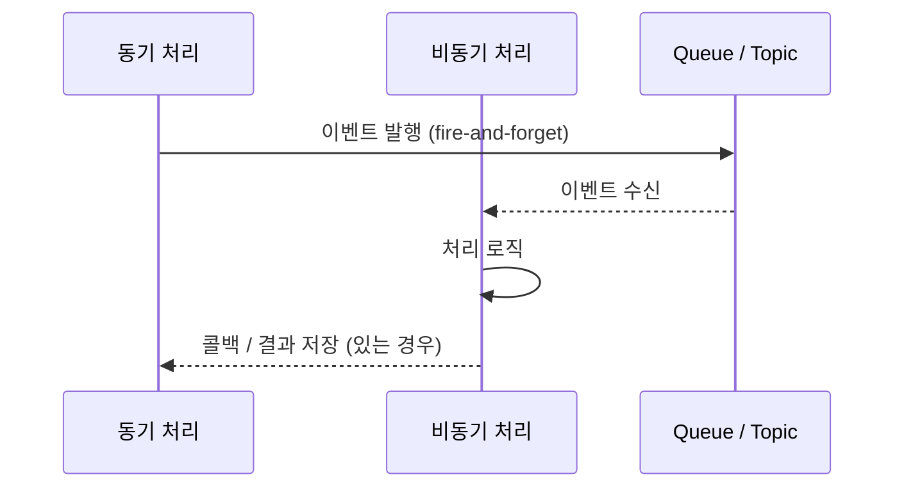

---

### 11. 캐시 히트/미스 흐름

캐시가 적용된 서비스의 캐시 전략과 데이터 흐름을 표현한다.

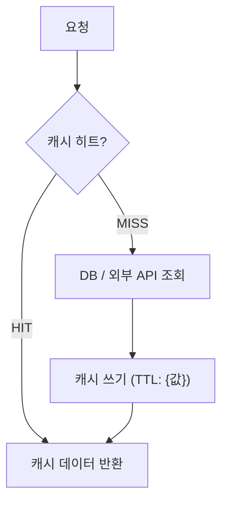

| 캐시 키 패턴 | 캐시 저장소 | TTL | Evict 조건 |
|:---|:---|:---|:---|
| | Redis / Caffeine / EhCache | | |

---

### 11.5 핵심 알고리즘 / 설계 의사결정 Deep Dive

Rate Limiter, 캐시 분산 key, 재처리 배치, 정산 판정, 토큰 검증, 멱등성, 락, 재시도/보상 트랜잭션처럼 시스템 품질을 좌우하는 알고리즘이 있으면 반드시 작성한다.

| 항목 | 내용 | 근거 |
|:---|:---|:---|
| 문제 | 어떤 운영/성능/정합성 문제를 해결하려는가 | `{wiki/code/config}` |
| 알고리즘 | Token Bucket / state machine / round-robin / retry / idempotency 등 | `{ClassName}:{line}` |
| 키/상태 모델 | Redis key, DB status, Kafka key, lock key, cache key 등 | `{ClassName}:{line}` |
| 설정값 | TPS, TTL, timeout, retry count, bucket size 등 | `{application*.yaml}` |
| 코드 진입점 | 핵심 class/method/filter/job/consumer | `{path}:{line}` |
| 운영/성능 근거 | Wiki 성능 테스트, 모니터링, 장애/인수인계 문서 | `{wiki evidence}` |
| 한계/주의 | hotspot, 중복 처리, race condition, 장애 시 영향 | `{evidence}` |

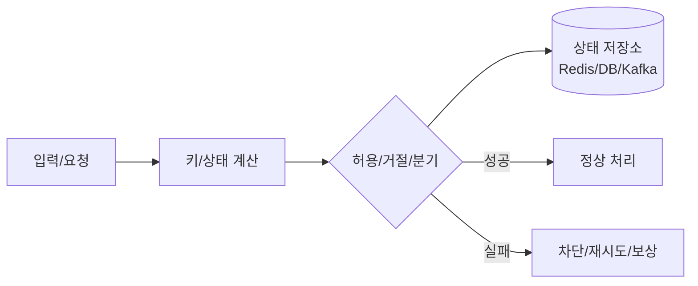

작성 금지:
- “Redis 사용”, “Kafka 사용”처럼 기술명만 쓰고 알고리즘/키/설정/근거를 생략하는 것
- Wiki 설명만으로 구현 사실을 단정하는 것
- password/token/secret 원문을 키/설정 표에 쓰는 것

---

### 12. 오류 전파 및 복구 흐름

오류가 발생했을 때 서비스 계층에서 어떻게 처리되고 상위 계층으로 전파되는지 표현한다.

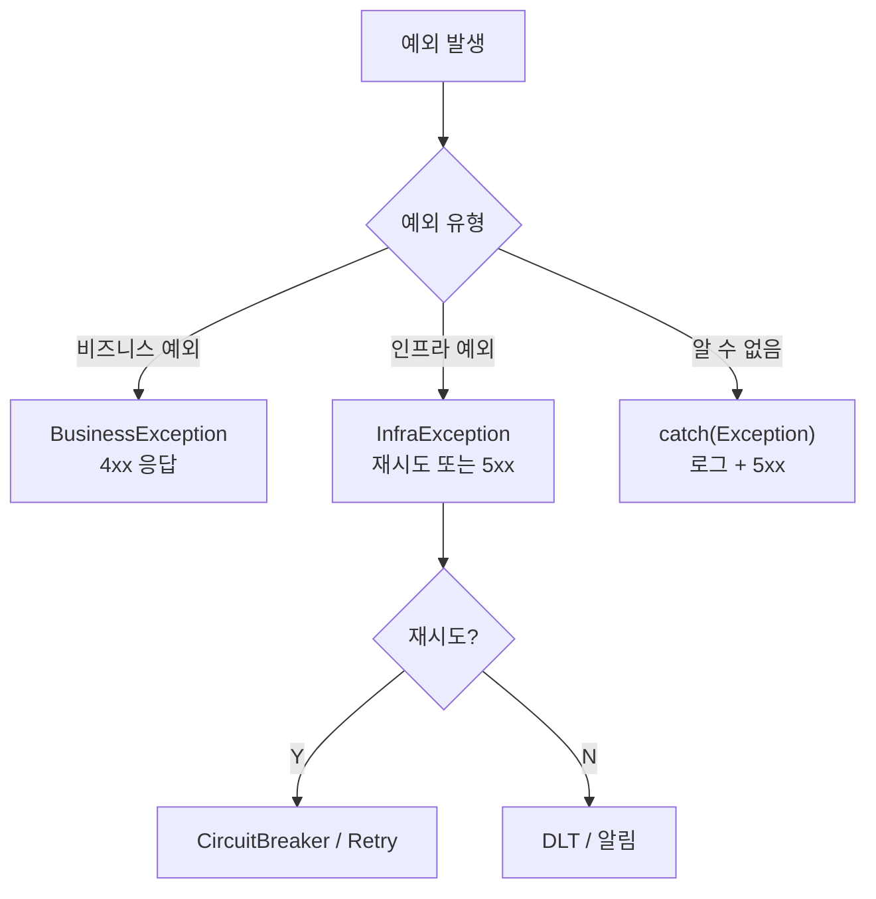

**예외 클래스 계층:**

| 예외 클래스 | 부모 클래스 | HTTP 상태 | 설명 |
|:---|:---|:---:|:---|
| | | | |

---

### 13. 크로스 서비스 데이터 흐름 (서비스 간 연동)

여러 마이크로서비스/모듈에 걸쳐 데이터가 흐르는 경우 전체 흐름을 표현한다.

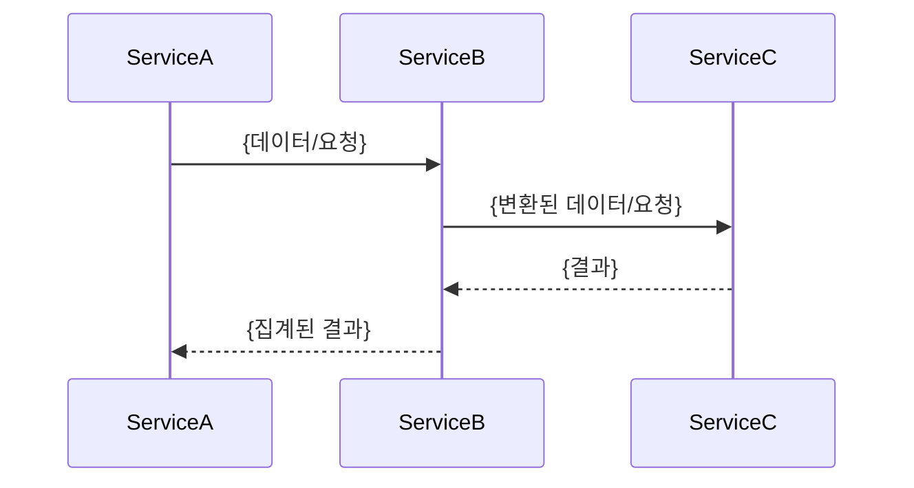

**데이터 계약 (Data Contract):**

| 소스 서비스 | 대상 서비스 | 데이터 구조 | 동기/비동기 |
|:---|:---|:---|:---|
| | | | |

---

## 작성 규칙

1. **코드 추적 필수** — 작성된 모든 흐름은 실제 소스 파일의 클래스명/메서드명/라인번호로 검증되어야 한다
2. **추측 금지** — 코드에서 확인된 사실만 기술, 불확실한 경우 `> ⚠️ 확인 필요` 표기
3. **시퀀스 + 데이터플로우 필수** — 대표 기능마다 섹션 3의 `sequenceDiagram`과 섹션 4의 업무 데이터플로우 `flowchart LR`를 함께 작성한다
4. **상태 변이 명시** — DB 레코드의 상태값(status, yn 등)이 변경되는 시점을 명확히 표시
5. **비동기 경계 표시** — 동기/비동기 처리 전환 지점을 다이어그램에 명확히 구분
6. **데이터 구조 명시** — 계층 간 전달되는 DTO/Entity의 핵심 필드를 명시
7. **트랜잭션 경계 표시** — @Transactional 범위와 롤백 조건을 반드시 기술
8. **Mermaid 안정성** — `graph TD/LR`와 `A --> B & C` 축약 문법을 쓰지 않고 `flowchart TD/LR`와 한 줄 한 관계를 사용한다. API path/URL/슬래시(`/`)가 들어간 노드 라벨은 `B["GET /v1/order/inflow/list 조회"]`처럼 quote 처리한다
9. **Mermaid Markdown 호환성** — Confluence Mermaid는 노드 라벨 내부 Markdown list를 지원하지 않으므로 `"1. ..."`, `"- ..."`, `<br/>1. ...`, `<br/>- ...` 형태를 쓰지 않는다. 단계는 `"Step 1 - ..."` 또는 `"S1: ..."`로 쓴다
10. **Literal newline 금지** — Mermaid 라벨/메시지 안에 literal backslash+n을 쓰지 않는다. 줄바꿈은 `<br/>`를 사용하고, sequenceDiagram 메시지는 한 문장 또는 ` - `로 이어 쓴다
11. **Excalidraw 내보내기** — 이 문서를 Excalidraw로 변환할 때 `scripts/render-excalidraw-from-mermaid.js`를 우선 사용한다. Arrow Type은 `직각`만 사용하고, JSON 생성 시 arrow element는 `elbowed: true`, `roundness: null`, port/rail routing, 수평/수직 `points`를 가져야 하며 대각선 2-point arrow, 노드 관통, 라벨 겹침은 금지한다
12. **한국어 작성** — 기술 용어(클래스명, 메서드명 등)는 원문 유지
13. **Wikilink 사용** — 관련 문서는 `[[문서명]]` 형태로 연결
