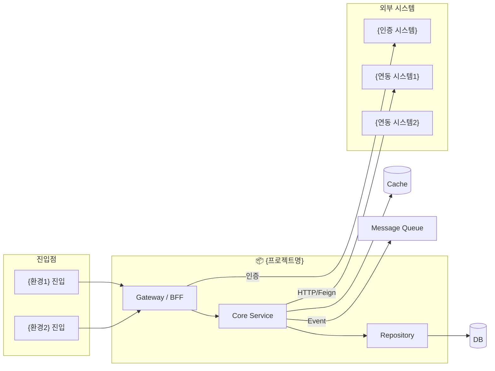
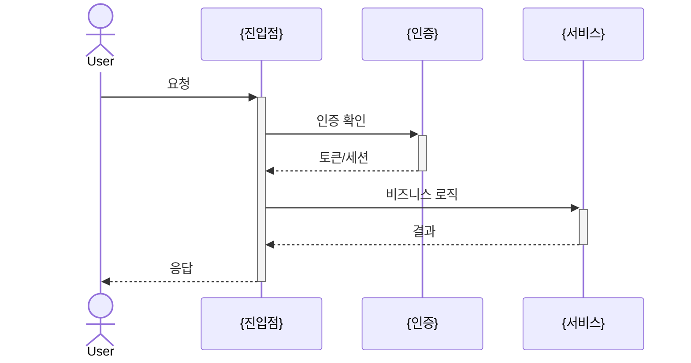

# Deep Research — {프로젝트명}

> 생성일: {날짜}  
> 분석 대상: `{타겟 경로}`  
> 집중 질문: `{SONAR_DEEP_QUESTIONS 파일명 또는 "없음"}`  
> 분석 환경: `{SONAR_DEEP_ENVS 또는 "자동 감지"}`

---

## 도메인 요약

| 항목 | 내용 |
|:---|:---|
| 도메인 유형 | {e-commerce / auth / payment / logistics / cms / ads / ...} |
| 핵심 비즈니스 엔티티 | {Entity1, Entity2, Entity3, ...} |
| 기술 스택 | {Spring Boot 3.x, Kotlin, MySQL, Kafka, ...} |
| 활성 환경 | {local, dev, stg, prd, ...} |
| 외부 연동 시스템 | {시스템1, 시스템2, ...} |
| 크로스레포 탐색 결과 | {발견 N개 / 미발견} |

---

## 분석 색인

이 문서 하나로 전체 구조를 파악하고, 상세 내용은 하위 문서로 이동한다.

| 문서 | 내용 |
|:---|:---|
| [ENV-MATRIX.md](./ENV-MATRIX.md) | 환경별 진입점, 설정, 기능 차이 |
| [INTEGRATION-FLOW.md](./INTEGRATION-FLOW.md) | 외부 연동 토폴로지 + 인증 체인 플로우 |
| [BUSINESS-STATE-MACHINE.md](./BUSINESS-STATE-MACHINE.md) | 비즈니스 엔티티별 상태 머신 |
| [USER-JOURNEY.md](./USER-JOURNEY.md) | API 엔드포인트별 전체 호출 체인 |
| [QUESTION-ANSWER.md](./QUESTION-ANSWER.md) | 집중 질문별 코드 근거 기반 답변 |

---

## 시스템 전체 구성도



---

## 비즈니스 플로우 요약

### 핵심 유저 저니

> 전체 상세는 [USER-JOURNEY.md](./USER-JOURNEY.md) 참조

{프로젝트의 가장 중요한 유저 저니를 1~2개 요약}



### 핵심 비즈니스 상태 전이

> 전체 상세는 [BUSINESS-STATE-MACHINE.md](./BUSINESS-STATE-MACHINE.md) 참조

{가장 중요한 엔티티의 상태 전이를 요약}

```mermaid
stateDiagram-v2
  [*] --> {초기상태}
  {초기상태} --> {중간상태} : {트리거}
  {중간상태} --> {완료상태} : {조건}
  {중간상태} --> {실패상태} : {예외조건}
```

---

## 인테그레이션 요약

> 전체 상세는 [INTEGRATION-FLOW.md](./INTEGRATION-FLOW.md) 참조

| 연동 시스템 | 프로토콜 | 목적 | 인증 방식 |
|:---|:---|:---|:---|
| {시스템1} | HTTP/Feign | {목적} | {API Key / OAuth2 / JWT} |
| {시스템2} | Kafka | {목적} | {없음 / SASL} |

---

## 환경별 주요 차이

> 전체 상세는 [ENV-MATRIX.md](./ENV-MATRIX.md) 참조

{환경마다 동작이 다른 가장 중요한 항목 2~3개만 요약}

---

## 집중 질문 요약

> 전체 답변은 [QUESTION-ANSWER.md](./QUESTION-ANSWER.md) 참조

{질문이 있는 경우, 각 질문에 대한 한 줄 결론만 표시}

| 질문 | 결론 |
|:---|:---|
| {Q1} | {한 줄 답} |
| {Q2} | {한 줄 답} |

---

## 리스크 및 확인 필요 항목

> 분석 중 근거를 찾지 못했거나 불확실한 항목

| 항목 | 위치 | 내용 |
|:---|:---|:---|
| ⚠️ {항목1} | {문서:섹션} | {확인 필요 이유} |
