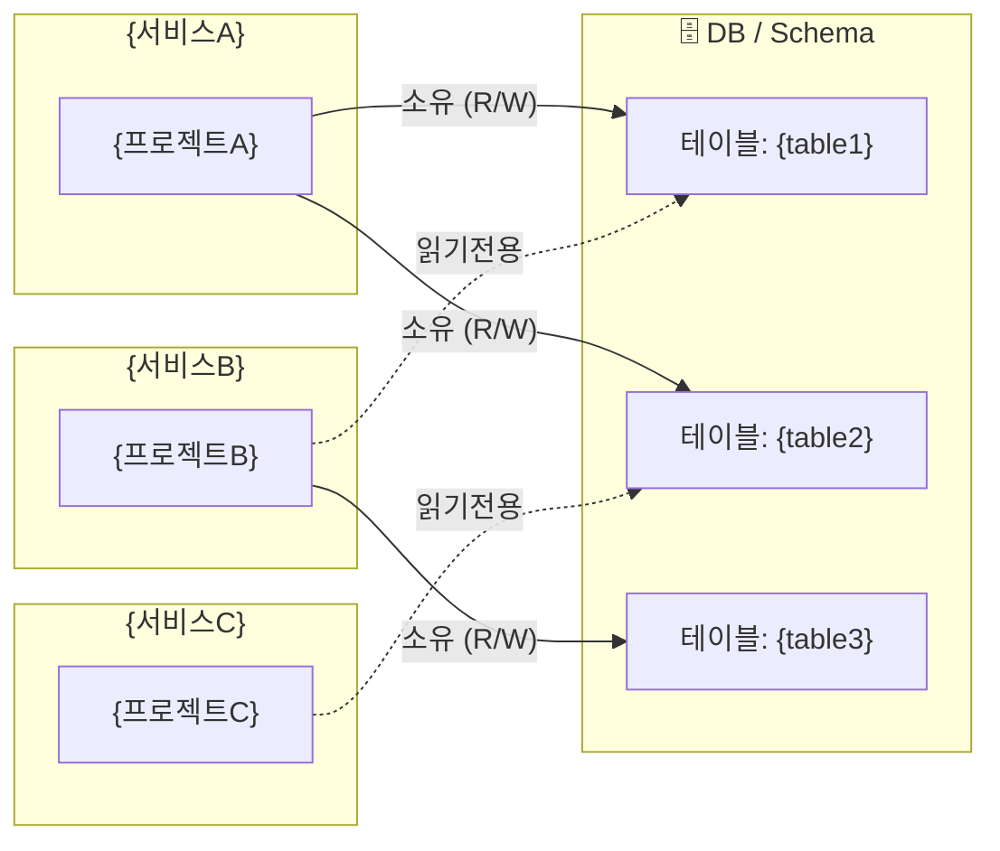

# ENTITY-RELATIONSHIP — {시스템명} 크로스서비스 엔티티 관계

> 생성일: {날짜}  
> 분석 범위: `{SONAR_OUTPUT_DIR}` 하위 전체 프로젝트  
> 개별 프로젝트 DB 상세는 `{project}/DATABASE.md` 참조

---

## 1. 서비스-테이블 오너십 매핑

> 어느 서비스가 어느 테이블을 소유(Write 권한)하고 어느 서비스가 읽기만 하는지.  
> 점선 = 읽기전용 접근, 실선 = 소유(Write 포함)



---

## 2. 서비스별 오너십 테이블

| 서비스 | 소유 테이블 | 읽기 전용 접근 | DB |
|:---|:---|:---|:---|
| `{서비스A}` | `{table1}`, `{table2}` | `{table3}` | `{db명}` |
| `{서비스B}` | `{table3}` | `{table1}` | `{db명}` |

**근거:**

| 서비스 | 근거 |
|:---|:---|
| `{서비스A}` | `@Entity` 정의 [code: {파일}:{라인}], Write 쿼리 확인 [code: {파일}:{라인}] |
| `{서비스B}` | Read-only Repository [code: {파일}:{라인}] |

---

## 3. 시스템 전체 핵심 ERD

> 전체 시스템에서 핵심이 되는 엔티티만 포함한다. 세부 컬럼은 각 프로젝트의 `DATABASE.md` 참조.

```mermaid
erDiagram
    %% {서비스A} 엔티티
    {Entity1} {
        {type} id PK
        {type} {key_col}
    }
    {Entity2} {
        {type} id PK
        {type} {entity1_fk} FK
    }

    %% {서비스B} 엔티티
    {Entity3} {
        {type} id PK
        {type} {key_col}
    }

    %% 크로스서비스 관계
    {Entity1} ||--o{ {Entity2} : "{관계}"
    {Entity2} }o--|| {Entity3} : "{관계}"
```

---

## 4. 크로스서비스 데이터 의존 감지

> 서비스 경계를 넘어 직접 DB 테이블을 공유하는 패턴 감지.  
> 이런 패턴은 마이크로서비스 분리 시 제약이 되므로 별도 표시한다.

### 발견된 직접 공유 패턴

| 접근하는 서비스 | 테이블 | 테이블 소유자 | 접근 방식 | 리스크 |
|:---|:---|:---|:---|:---|
| `{서비스B}` | `{table1}` | `{서비스A}` | 직접 JOIN / 직접 Read | 스키마 변경 시 영향 받음 |

> **⚠️ Anti-pattern:** 위 직접 공유 테이블들은 서비스 경계 분리 시 API 호출 또는 이벤트 기반 통신으로 전환 권고.

### 공유 없음 (독립 DB 서비스)

| 서비스 | 독립 DB | 비고 |
|:---|:---|:---|
| `{서비스C}` | `{db명}` | 타 서비스와 직접 DB 공유 없음 |

---

## 5. 이벤트 기반 데이터 연동

> Kafka/MQ 등 이벤트로 데이터를 전달하는 경우 (직접 DB 공유 대신).

| 발행 서비스 | 토픽 | 소비 서비스 | 목적 |
|:---|:---|:---|:---|
| `{서비스A}` | `{topic}` | `{서비스B}` | `{서비스B}` DB에 denormalize 복사 |

---

## 6. 분석 한계 및 확인 필요

| 항목 | 이유 | 권고 |
|:---|:---|:---|
| {항목1} | 동적 테이블명으로 정적 분석 불가 | MCP devdb로 런타임 확인 |
| {항목2} | 공통 라이브러리의 엔티티 정의 미포함 | 공통 레포 코드 추가 분석 필요 |
