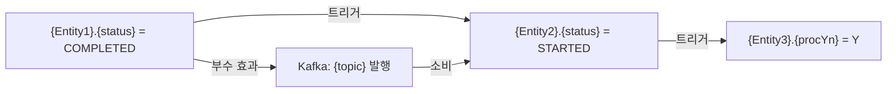

# ENTITY-STATE-LIFECYCLE — {프로젝트명} 엔티티 상태 생명주기

> 생성일: {날짜}  
> 분석 대상: `{타겟 경로}`  
> 핵심 질문: **어떤 비즈니스 플로우가 어떤 엔티티 값을 어떻게 바꾸는가?**

이 문서는 도메인 엔티티의 상태 필드가 어떤 비즈니스 이벤트/플로우를 통해 변화하는지를  
엔티티 중심으로 통합 정리한다. DATA-FLOW.md의 플로우 중심 뷰와 상호 보완 관계다.

---

## 상태 필드 인벤토리

> 이 프로젝트에서 비즈니스 의미를 가지는 상태 필드 전체 목록.

| 엔티티 | 필드명 | 타입 | 값 범위 | 역할 |
|:---|:---|:---|:---|:---|
| `{Entity}` | `{status}` | `{String/Enum/Integer}` | `{A / B / C}` | {이 필드가 가지는 비즈니스 의미} |
| `{Entity}` | `{procYn}` | `{char(1)}` | `{Y / N}` | {처리 완료 여부} |

---

{각 엔티티/필드별로 아래 섹션을 반복}

---

## {EntityName} — `{status_field}`

> 코드 정의: `[code: {EntityFile}:{line}]`  
> 테이블.컬럼: `{table_name}.{column_name}`

### 상태 전이 다이어그램

```mermaid
stateDiagram-v2
    direction LR
    [*] --> {초기상태} : {생성 트리거}

    {초기상태} --> {상태A} : {비즈니스 이벤트 또는 API}
    {상태A} --> {상태B} : {조건 또는 이벤트}
    {상태B} --> {완료상태} : {완료 조건}
    {상태A} --> {취소상태} : {취소/실패 조건}
    {취소상태} --> [*]
    {완료상태} --> [*]

    note right of {상태A}
        {이 상태에서 가능한 추가 동작}
    end note
```

### 상태값 정의

| 상태값 | 한국어 의미 | 진입 조건 | 코드 근거 |
|:---|:---|:---|:---|
| `{PENDING}` | {대기중} | {엔티티 최초 생성 시 기본값} | [code: {파일}:{라인}] |
| `{PROCESSING}` | {처리중} | {특정 비즈니스 조건 충족} | [code: {파일}:{라인}] |
| `{COMPLETED}` | {완료} | {처리 성공} | [code: {파일}:{라인}] |
| `{CANCELLED}` | {취소/실패} | {취소 요청 또는 오류} | [code: {파일}:{라인}] |

### 비즈니스 플로우 × 상태 변화 매트릭스

> 어떤 비즈니스 플로우(API, 이벤트, 배치)가 이 필드를 변경하는지 전체 목록.

| 트리거 유형 | 트리거 식별자 | 현재 상태 | 변경 후 상태 | 처리 메서드 | 부수 효과 |
|:---|:---|:---|:---|:---|:---|
| REST API | `{POST /orders}` | `[*]` | `PENDING` | [code: `{Controller}:{line}`] → [code: `{Service}:{line}`] | — |
| Kafka 이벤트 | `{payment.completed}` | `PENDING` | `PAID` | [code: `{ConsumerClass}:{line}`] → [code: `{Service}:{line}`] | 재고 감소 이벤트 발행 |
| 배치 Job | `{DailySettlementJob}` | `PAID` | `SETTLED` | [code: `{BatchConfig}:{line}`] | 정산 레코드 생성 |
| 내부 서비스 호출 | `{OrderConfirmService}` | `PAID` | `CONFIRMED` | [code: `{Service}:{line}`] | 알림 발송 |
| 스케줄러 | `{@Scheduled}` | `PENDING` | `EXPIRED` | [code: `{SchedulerClass}:{line}`] | 만료 알림 |

### 상태 변경 코드 상세

> 각 상태 변경이 실제 코드에서 어떻게 일어나는지 핵심 패턴.

#### `PENDING` → `PAID` 전이

**트리거:** Kafka 이벤트 `{payment.completed}` 수신

```
[code: PaymentEventConsumer.java:45]  ← 이벤트 수신
  └→ [code: OrderService.java:112]   ← 상태 변경
       └→ order.setStatus("PAID")    ← 실제 변경
       └→ orderRepository.save()     ← DB 반영
       └→ eventPublisher.publish()   ← 부수 이벤트 발행
```

**트랜잭션 경계:** `@Transactional` [code: {파일}:{라인}]  
**부수 효과:**
- `{관련 테이블/필드}` 업데이트 [code: {파일}:{라인}]
- 이벤트 발행: `{event.topic}` [code: {파일}:{라인}]

#### `{상태}` → `{상태}` 전이

{동일 패턴 반복}

### 비정상 전이 / 중복 처리 방어

> 같은 이벤트가 두 번 오거나 잘못된 상태에서 전이가 시도될 때의 처리.

| 상황 | 처리 방식 | 코드 근거 |
|:---|:---|:---|
| 이미 PAID인데 payment.completed 재수신 | 멱등성 체크 후 무시 | [code: {파일}:{라인}] |
| CANCELLED 상태에서 PAID 전이 시도 | 예외 발생: `{ExceptionClass}` | [code: {파일}:{라인}] |

---

## {다른 엔티티의 다른 상태 필드} — `{다른 필드}`

{동일 구조 반복}

---

## 크로스 엔티티 상태 연동

> 한 엔티티의 상태 변화가 다른 엔티티의 상태에 영향을 주는 연쇄 관계.



| 원인 엔티티 + 상태 | 영향 엔티티 + 상태 | 연결 방식 | 코드 근거 |
|:---|:---|:---|:---|
| `{Entity1}.status = COMPLETED` | `{Entity2}.status = STARTED` | 직접 호출 | [code: {파일}:{라인}] |
| `{Entity1}.status = COMPLETED` | `{Entity3}.procYn = Y` | Kafka 이벤트 경유 | [code: {파일}:{라인}] |

---

## 상태 변화 히트맵

> 어떤 상태 전이가 얼마나 자주 / 어떤 경로로 일어나는지 한눈에 파악.

| 엔티티.필드 | 가장 많은 전이 | 트리거 수 | 부수 효과 수 | 복잡도 |
|:---|:---|:---|:---|:---|
| `{Entity}.status` | `{PENDING→PAID}` | {N}개 | {M}개 | {높음/중간/낮음} |

---

## ⚠️ 확인 필요

| 항목 | 이유 |
|:---|:---|
| {항목1} | 코드에서 상태 변경 코드를 찾았으나 트리거 진입점 불명확 |
| {항목2} | 상태값 의미를 DB 주석 없이 코드만으로 추론 |
