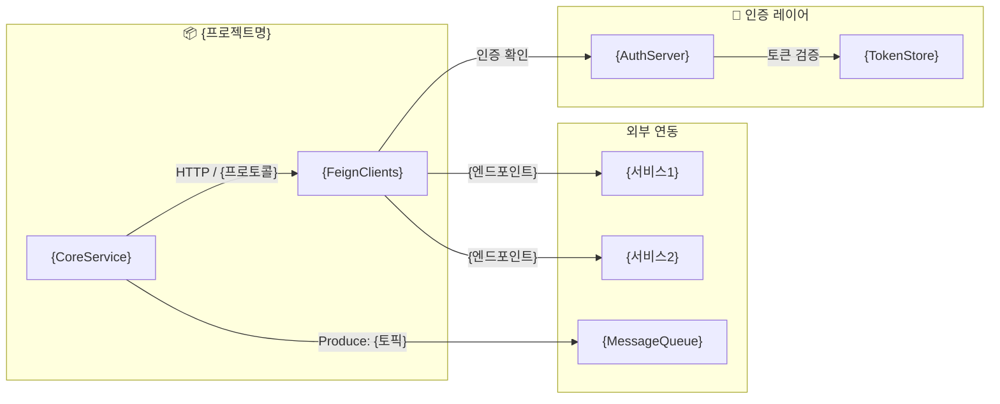
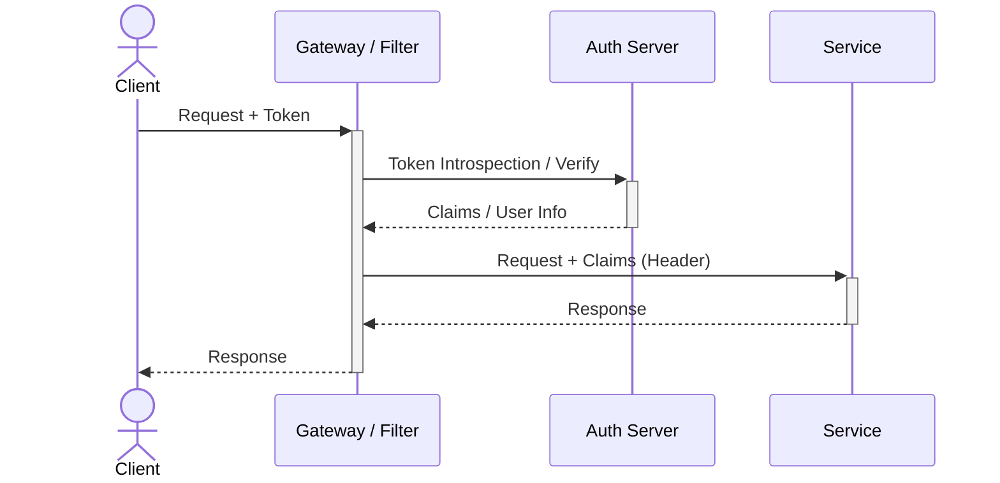

# INTEGRATION-FLOW — {프로젝트명} 인테그레이션 플로우

> 모든 외부/내부 서비스 연동 지점과 인증 체인을 코드 레벨 근거로 정리합니다.

---

## 인테그레이션 토폴로지



---

## 아웃바운드 호출 전체 목록

### HTTP / REST

| 대상 서비스 | 클라이언트 유형 | 엔드포인트 | 호출 위치 | 에러 처리 |
|:---|:---|:---|:---|:---|
| {서비스1} | FeignClient | `{METHOD /path}` | [code: {파일}:{라인}] | Fallback: {없음/있음} |
| {서비스2} | WebClient | `{METHOD /path}` | [code: {파일}:{라인}] | Retry: {N}회 |

### 이벤트 / 메시지

| 역할 | 토픽/큐 | 이벤트 타입 | 코드 위치 | 재처리 |
|:---|:---|:---|:---|:---|
| Producer | `{topic1}` | `{EventType}` | [code: {파일}:{라인}] | {없음/DLQ} |
| Consumer | `{topic2}` | `{EventType}` | [code: {파일}:{라인}] | {retry N} |

### gRPC / 기타

| 대상 | 프로토콜 | 메서드 | 코드 위치 |
|:---|:---|:---|:---|
| {서비스} | gRPC | `{ServiceName/Method}` | [code: {파일}:{라인}] |

---

## 인증 체인 분석

### 인증 처리 순서



### 인증 파이프라인 목록

{애플리케이션 내에 복수의 인증 파이프라인이 있으면 각각 기술}

#### 파이프라인 1: {파이프라인명 또는 경로 패턴}

- **적용 경로:** `{/**}` 또는 `{/api/v1/**}`
- **인증 방식:** {OAuth2 / JWT / Session / API Key}
- **설정 위치:** [code: SecurityConfig.java:23]
- **토큰 처리:** {JwtDecoder / TokenIntrospector / ...}
- **인증 성공 핸들러:** [code: {파일}:{라인}]
- **인증 실패 핸들러:** [code: {파일}:{라인}]

#### 파이프라인 2: {파이프라인명 또는 경로 패턴}

- **적용 경로:** `{/api/v2/**}`
- **인증 방식:** {OIDC / SAML / ...}
- **설정 위치:** [code: {파일}:{라인}]
- ...

---

## FOCUS_AREAS 집중 분석

{Phase 0에서 전달받은 FOCUS_AREAS가 있을 때 각 항목별 섹션 생성}

### {FOCUS_AREA 1}

**관련 코드 흐름:**

```
{진입점} → {중간 처리} → {외부 호출 또는 상태 변경}
[code: 파일A:라인] → [code: 파일B:라인] → [code: 파일C:라인]
```

**핵심 발견:**
- {발견1} [code: {파일}:{라인}]
- {발견2} [config: {파일}:{키}]

**크로스레포 연관:**
- {발견된 연관 레포} [github: {레포}:{파일}:{라인}]
- > ⚠️ 레포 미발견: {탐색 키워드}

---

## 크로스레포 의존성

`resources/github/CROSS-REPO-INDEX.md` 참조.

| 연관 레포 | 연관 근거 | 이 프로젝트에서 호출하는 지점 |
|:---|:---|:---|
| {레포명} | [code: {FeignClient}:{라인}] | `{METHOD /path}` → [github: {레포}:{컨트롤러}:{라인}] |
| (미발견) | [code: {호출 코드}:{라인}] | 레포 탐색 실패 — URL만 확인 |

---

## Circuit Breaker / Resilience 패턴

| 대상 | 패턴 | 설정 위치 |
|:---|:---|:---|
| {서비스1} | Resilience4j CircuitBreaker | [code: {파일}:{라인}] |
| {서비스2} | Feign Fallback | [code: {FallbackClass}:{라인}] |

---

## ⚠️ 확인 필요

| 항목 | 이유 |
|:---|:---|
| {항목1} | 호출 코드는 있으나 대상 서비스 레포 미발견 |
| {항목2} | 인증 방식이 설정 파일에 명시되지 않음 |
