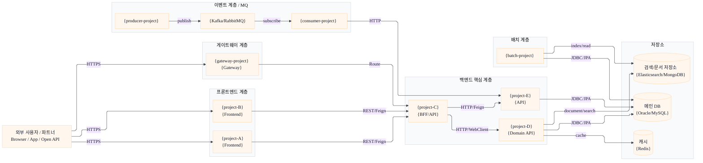
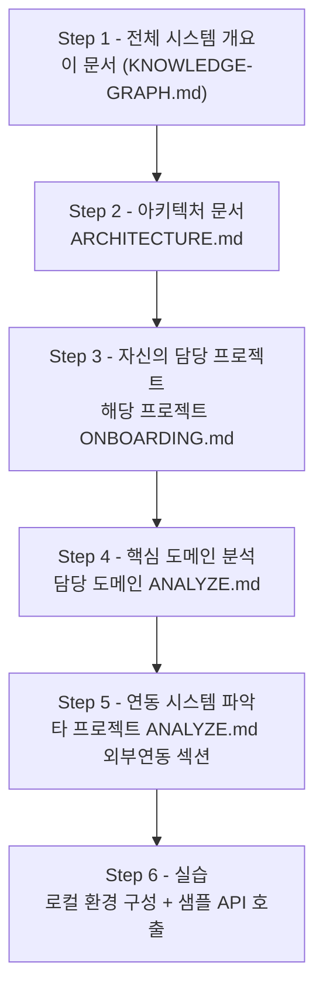

# 전체 시스템 지식그래프 (KNOWLEDGE-GRAPH.md)

> **생성 기준:** `sonar:graph` 커맨드 실행 시 `sonar-out/*/ARCHITECTURE.md` 및 `sonar-out/*/ANALYZE-*.md`를 읽어 자동 생성된다.
> **최초 작성일:** {YYYY-MM-DD}
> **분석 대상 디렉토리:** `{target_dir}`
> **포함된 프로젝트 수:** {N}개

---

## 1. 전체 시스템 개요

> 이 시스템을 구성하는 모든 프로젝트의 역할과 관계를 요약한다.

| 프로젝트명 | 역할 | 기술스택 | 담당 도메인 |
|:---|:---|:---|:---|
| **{project-A}** | {API 서버 / 프론트엔드 / 배치 등} | {Spring Boot / Next.js / .NET} | {도메인명} |
| **{project-B}** | | | |

---

## 2. 전체 시스템 노드 그래프

> 프로젝트 간 의존관계를 노드 그래프로 표현한다.
> 노드: 프로젝트, 외부 시스템, 공유 DB/캐시. 엣지: API 호출, DB 공유, 이벤트 발행/구독.
> 통합 그래프는 한 장으로 유지하되, 좌우 레이어 배치를 강제해 선 꼬임을 줄인다.

> **그래프 요약:** {전체 시스템의 주요 데이터 흐름을 2~3줄로 요약}

---

## 3. 프로젝트 간 API 의존관계 맵

> 프로젝트 A가 프로젝트 B의 어떤 API를 호출하는지 표로 명시한다.
> System Index에는 전체 통합 그래프만 유지하고, 상세 시퀀스/데이터플로우 다이어그램은 각 프로젝트의 `Data Flow.md`에 작성한다.

| 호출자 | 피호출자 | 엔드포인트 | 용도 | 인증 방식 |
|:---|:---|:---|:---|:---|
| **{project-A}** | **{project-B}** | `GET /api/v1/{resource}` | {용도} | {API Key / JWT} |
| **{project-B}** | **{외부 시스템}** | `POST {endpoint}` | {용도} | {인증 방식} |

| 상세 흐름 문서 | 포함 다이어그램 | 설명 |
|:---|:---|:---|
| `[[{project-A}/Data Flow]]` | `sequenceDiagram`, 업무 데이터플로우 `flowchart LR` | {대표 사용자/이벤트/배치 흐름} |
| `[[{project-B}/Data Flow]]` | `sequenceDiagram`, 업무 데이터플로우 `flowchart LR` | {대표 API/저장소 흐름} |

---

## 4. 운영 / 서버 인벤토리

> System Index는 통합 그래프뿐 아니라 실제 운영자가 처음 확인해야 하는 서버, 도메인, Swagger, Fusion/RMS, 포트, 운영 정책을 함께 제공한다.
> `_wiki-sources/`에 인수인계, 운영, 서버, DB 세팅, 모니터링, Fusion, RMS, Swagger, host/pod/TPS 문서가 있으면 이 섹션을 생략하지 않는다.

### 4.1 서비스 엔드포인트

| 영역 | 서비스 / 모듈 | 환경 | 도메인 / Host | Fusion / RMS / Swagger | 근거 |
|:---|:---|:---|:---|:---|:---|
| {gateway} | `{service-name}` | {local/dev/av/prod} | `{domain-or-host}` | `{fusion/rms/swagger}` | `{wiki/code/config evidence}` |

### 4.2 런타임 포트

| 프로젝트 / 모듈 | Local app / management | Dev/AV/Prod app / management | 근거 |
|:---|:---|:---|:---|
| `{module}` | `{port}` / `{management-port}` | `{port}` / `{management-port}` | `{application*.yaml}` |

### 4.3 운영 정책 / 인수인계 포인트

| 주제 | 운영 규칙 | 확인 위치 | 근거 |
|:---|:---|:---|:---|
| `{gate/channel target-url}` | `{정책 요약}` | `{Admin/Swagger/Log}` | `{wiki evidence}` |

### 4.4 민감정보 처리

- 비밀번호, 토큰, Vault key, API secret은 문서에 원문으로 남기지 않고 `문의 필요`, `redacted`, `환경변수 참조`처럼 표기한다.
- Wiki에 password 예시가 있더라도 System Index에는 host/port/접속 방식까지만 남기고 인증값은 제거한다.
- 코드와 Wiki의 서버 정보가 다르면 둘 다 근거와 함께 쓰고 `확인 필요`로 표시한다.

---

## 5. 공유 도메인 / 엔티티 목록

> 2개 이상의 프로젝트에서 공통으로 사용하는 도메인 개념과 DB 테이블을 정리한다.

| 공유 엔티티 | 정의 프로젝트 | 사용 프로젝트 | DB 테이블 | 설명 |
|:---|:---|:---|:---|:---|
| **{엔티티명}** | {project-A} | {project-B, project-C} | `{TABLE_NAME}` | {엔티티 설명} |
| **{엔티티명}** | | | | |

### 5.1 도메인 용어 통합 사전

> 프로젝트별로 같은 개념을 다른 용어로 부르는 경우를 정리한다.

| 표준 용어 | project-A에서 사용 | project-B에서 사용 | 설명 |
|:---|:---|:---|:---|
| **{표준 용어}** | `{용어A}` | `{용어B}` | {통합 설명} |

---

## 6. 공유 인프라

### 6.1 데이터베이스

| DB명 | 종류 | 사용 프로젝트 | 주요 테이블 그룹 | 비고 |
|:---|:---|:---|:---|:---|
| **{db-name}** | {Oracle / MySQL / PostgreSQL} | {project-A, project-B} | {테이블 그룹 목록} | {Primary-Replica 구성 등} |

### 6.2 캐시

| 캐시 인스턴스 | 종류 | 사용 프로젝트 | 주요 키 패턴 |
|:---|:---|:---|:---|
| **{cache-name}** | {Redis / Memcached} | {project-A, project-B} | `{prefix}:*` |

### 6.3 메시지 큐

| 큐/토픽명 | 브로커 | 발행자 | 구독자 | 용도 |
|:---|:---|:---|:---|:---|
| **{topic-name}** | {Kafka / RabbitMQ} | {project-A} | {project-B} | {용도} |

---

## 7. 기술 스택 비교 매트릭스

| 항목 | {project-A} | {project-B} | {project-C} |
|:---|:---|:---|:---|
| **언어** | | | |
| **프레임워크** | | | |
| **DB** | | | |
| **캐시** | | | |
| **빌드 도구** | | | |
| **테스트 프레임워크** | | | |
| **배포 방식** | | | |
| **CI/CD** | | | |

---

## 8. 신규 합류자 온보딩 로드맵

> 새로 합류한 개발자가 전체 시스템을 파악하기 위한 추천 학습 순서.

### 8.1 권장 학습 순서

### 8.2 역할별 추천 진입점

| 역할 | 1순위 문서 | 2순위 문서 | 3순위 문서 |
|:---|:---|:---|:---|
| **백엔드 개발자** | `{BE project}/ONBOARDING.md` | `{BE project}/ANALYZE-{core-domain}.md` | `CROSS-DOMAIN-MAP.md` |
| **프론트엔드 개발자** | `{FE project}/ONBOARDING.md` | `{FE project}/ANALYZE-{core-page}.md` | API 명세 (`API-SPEC-*.md`) |
| **풀스택 개발자** | 이 문서 전체 | `TECH-STACK-MATRIX.md` | 담당 도메인 `ANALYZE.md` |
| **DevOps / 인프라** | `ARCHITECTURE.md` (각 프로젝트) | 배포 섹션 (섹션 6, 8) | `ENV.md` |
| **QA** | `ONBOARDING.md` | API 명세 전체 | 알려진 이슈 (섹션 19) |

### 8.3 첫 주 체크리스트

- [ ] 이 문서(`KNOWLEDGE-GRAPH.md`)를 처음부터 끝까지 읽는다
- [ ] 담당 프로젝트의 `ONBOARDING.md`에 따라 로컬 환경을 구성한다
- [ ] 핵심 도메인 `ANALYZE.md` 1개 이상을 읽는다
- [ ] 로컬에서 주요 API를 직접 호출해본다
- [ ] 연동되는 타 프로젝트의 외부 연동 포인트(섹션 10)를 확인한다

---

## 9. 시스템 변경 이력 (크로스 프로젝트)

> 여러 프로젝트에 동시에 영향을 주는 주요 변경 사항을 기록한다.

| 날짜 | 변경 내용 | 영향 프로젝트 | 참조 |
|:---|:---|:---|:---|
| {YYYY-MM-DD} | {변경 내용} | {project-A, project-B} | {Jira 티켓, PR 링크} |

---

## 10. 알려진 이슈 / 크로스 프로젝트 기술 부채

| 구분 | 내용 | 영향 프로젝트 | 우선순위 |
|:---|:---|:---|:---|
| **기술 부채** | {내용} | {프로젝트 목록} | 상/중/하 |
| **잠재적 장애 포인트** | {내용} | {프로젝트 목록} | 상/중/하 |

---

## 작성 규칙

1. **프로젝트 분석 완료 후 생성** — 모든 대상 프로젝트의 `ANALYZE.md`가 `sonar-out/` 에 존재한 뒤 이 문서를 작성한다
2. **Mermaid 그래프 필수** — 섹션 2(노드 그래프), 섹션 3(상세 문서 링크), 섹션 8.1(로드맵)은 다이어그램 또는 흐름 링크를 생략하지 않는다
3. **확인된 사실만 기술** — 코드/문서에서 근거를 찾지 못한 연결은 `> ⚠️ 확인 필요`로 표기한다
4. **GUIDE-MARKDOWN.md 준수** — 모든 마크다운 서식은 `guides/GUIDE-MARKDOWN.md` 규칙을 따른다
5. **한국어 작성** — 프로젝트명, 클래스명, API 경로 등 기술 식별자는 원문 유지
6. **운영 인수인계 반영** — Wiki source에 `인수인계`, `운영`, `서버`, `DB 세팅`, `모니터링`, `Fusion`, `RMS`, `Swagger`, `host`, `pod`, `TPS` 정보가 있으면 System Index의 운영/서버 인벤토리에 반영한다
7. **민감정보 보호** — password/token/secret/Vault 값은 원문으로 쓰지 않는다
