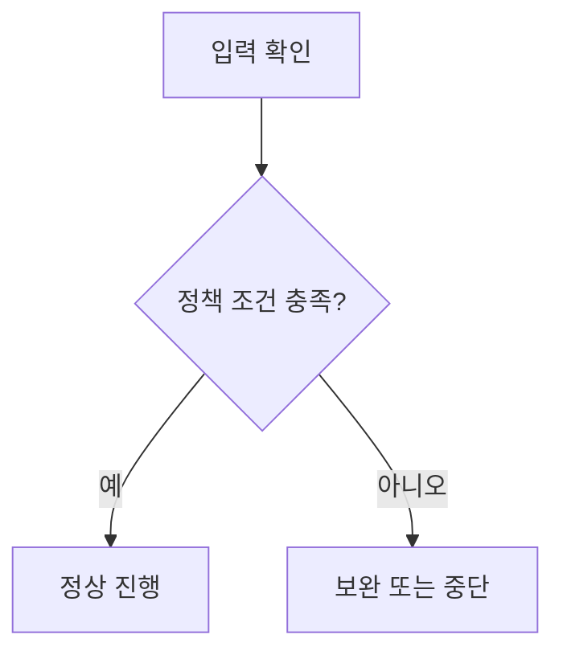

# POLICY.md — 분석/발행 정책 템플릿

> Code-Sonar 실행 중 반복 적용되는 규칙을 문서화한다.

## 1. 정책 정보

| 항목 | 내용 |
|:---|:---|
| 정책명 | {정책명} |
| 적용 범위 | {분석 / 그래프 / 위키 / QA / 공통} |
| 소유자 | {담당자 또는 팀} |
| 최종 수정일 | {YYYY-MM-DD} |

## 2. 정책 규칙

| ID | 규칙 | 위반 시 처리 |
|:---|:---|:---|
| P-01 | {규칙} | {처리 방식} |
| P-02 | {규칙} | {처리 방식} |

## 3. 결정 흐름

## 4. 설정값

| 설정 | 출처 | 기본값 | 설명 |
|:---|:---|:---|:---|
| `{설정명}` | {.env / sonar-config.md / 사용자 입력} | `{기본값}` | {설명} |

## 5. 검증

- 정책이 실제 프롬프트와 템플릿에 반영되었는지 확인한다.
- 위키 발행 정책은 `atls wiki ... --markdown-file` 기준으로 검증한다.
- Mermaid 정책은 렌더링 위험 문법 검색으로 검증한다.
