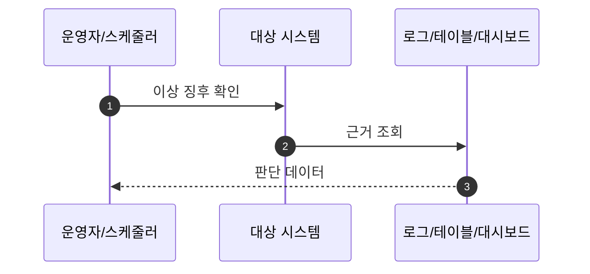

# Scenarios

> 사용자 정상 흐름보다 운영/예외 판단을 우선하는 시나리오 문서입니다. 각 시나리오는 실제 코드/Wiki/설정 근거와 연결하고, 운영자가 무엇을 확인하고 어떤 판단을 해야 하는지까지 적습니다.

## Rules

- 운영/예외 시나리오를 최소 6개 작성합니다.
- 정상 흐름은 1개 이하로 제한합니다.
- 각 시나리오는 `Trigger`, `증상`, `확인 순서`, `시스템 처리`, `운영자 판단`, `후속 조치`를 반드시 포함합니다.
- `sequenceDiagram`은 선택입니다. 업무 판단 표는 필수입니다.
- Wiki-only 근거는 설계/정책/운영 근거로 표시하고, 구현 사실은 code/config 근거와 함께 씁니다.

## Required Scenario Checklist

| 필수 시나리오 | 작성 여부 | 근거 |
|:---|:---:|:---|
| 주문 이벤트 누락 |  |  |
| LAST_TARGET_URL 미등록 |  |  |
| 주문-유입 매핑 실패 |  |  |
| 배송완료/환불 누락 보정 |  |  |
| 월지급 전 정합성 실패 |  |  |
| Open API token 검증 실패 |  |  |

## Scenario Template

### {운영/예외 시나리오명}

| 항목 | 값 |
|:---|:---|
| Trigger |  |
| 증상 |  |
| Projects |  |
| Evidence |  |

| 확인 순서 | 확인 위치 | 확인할 값 | 판단 | 후속 조치 |
|---:|:---|:---|:---|:---|
| 1 |  |  |  |  |
| 2 |  |  |  |  |
| 3 |  |  |  |  |

| 시스템 처리 | 운영자 판단 | 후속 조치 |
|:---|:---|:---|
|  |  |  |

## Open Questions

> 해당 없음
